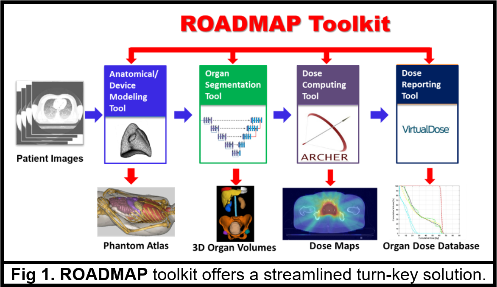
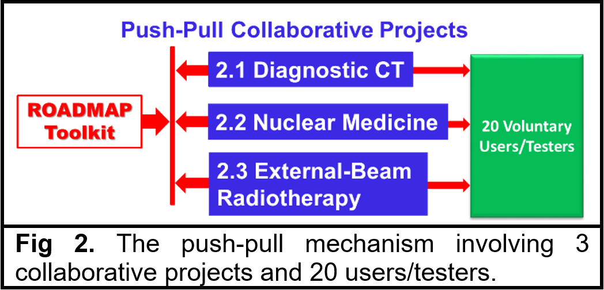
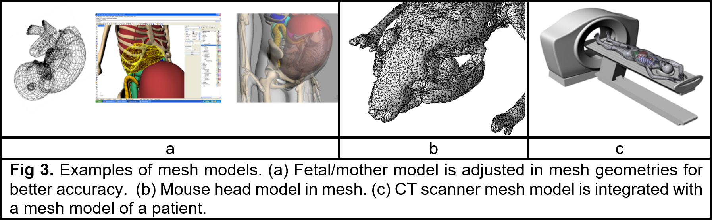

# [*ROADMAP* (Radiation OrgAn Doses in iMaging And theraPy)](http://www.rpi.edu/dept/radsafe/public_html/ROADMAP.htm)

### A Software Toolkit for Predicting and Tracking Patient Organ Doses 

Through continuous NIH funding in the past 20 years, we have made breakthroughs including the [**VIP-Man** computational phantom](http://www.virtualphantoms.org), [**VirtualDose** software for CT dose](http://www.virtualphantoms.com/our-products/virtualdose/), [**ARCHER** software](http://www.archer-mc.com/) for GPU-accelerated Monte Carlo dose computing, and, recently, [deep-learning (DL) based automatic multi-organ image segmentation](https://arxiv.org/abs/1908.00360). Herein we propose to integrate these tools into an agile, open-access and user-friendly computational toolkit, [**ROADMAP** (**Radiation OrgAn Doses in iMaging And theraPy**)](http://www.rpi.edu/dept/radsafe/public_html/ROADMAP.htm), which offers a turn-key solution to a range of advanced cancer research problems in radiological imaging (including X-ray CT, PET/CT, nuclear medicine) and radiation cancer treatment involving various types of ionizing radiation (external beams of high-energy photons, protons, brachytherapy, radionuclides, and radiopharmaceuticals).  These tools will allow clinicians, researchers, decision-makers and students to overcome challenges they currently face with existing disparate tools. The broad, long-term objective is to rapidly translate our research accomplishments into clinical practice by disseminating/maintaining a state-of-the-art software toolkit to the ionizing radiation based diagnostic imaging and radiotherapy community and beyond.     

Currently, the research community lacks robust free and open-access computational tools for extracting patient-specific organ volumes from tomographic images followed by rapid gold-standard Monte Carlo organ dose calculation. With the feasibility demonstrated recently by us and others in DL-based automatic multi-organ segmentation and GPU-accelerated Monte Carlo dose calculations, we now face the unprecedented opportunity to bring about a paradigm change that leads to personalized patient-specific organ dosimetry in radiological imaging, radiation therapy, epidemiologic risk assessment, and patient safety. Although individual members of this consortium have been serving as PI on NIH funded projects using our own approaches, it is clear that a coordinated effort involving a push-pull mechanism is required to ensure necessary clinical impact.

We have assembled a distinguished interdisciplinary consortium from Rensselaer Polytechnic Institute (RPI), Massachusetts General Hospital (MGH), Memorial Sloan Kettering Cancer Center (MSKCC), Yale and Vanderbilt with expertise in nuclear physics and engineering, Monte Carlo radiation transport simulation, machine learning, parallel computing, software engineering, finite element analysis, clinical radiology/radiation oncology/nuclear medicine, and epidemiologic risk assessment plus 20 committed voluntary software users/testers (see below) to achieve following four Specific Aims: 

**Aim 1.** Accelerate development of a unified framework (**Fig. 1**) of the **ROADMAP** toolkit by   	integrating/expanding the following software tools: (a) Patient anatomical and radiation device 	geometry  modeling, (b) DL-based automatic multi-organ segmentation, (c) GPU-based multi-particle Monte Carlo dose computing and (d) Dose Reporting.

**Aim 2.** Evaluate accuracy and utility of the **ROADMAP** toolkit by carrying out the following three parallel push-pull collaborative clinical application projects: (a) Diagnostic CT, (b) PET/CT and radionuclide therapy and (c) External-photon and proton beam therapy (**Fig. 2**). 

**Aim 3.** Maintain [**ROADMAP** GitHub repository](http://github.com/RoadmapSoftware/RoadMap)(**Fig. 3**) for software development, testing, validation, intercomparison, standardization and continuing self-sustainable update.

**Aim 4.** Facilitate dissemination of **ROADMAP** toolkit through community and professional engagement and feedback as part of the ITCR program activities including voluntary users below: 

**Software Users / Testers:**

1. Stanford (Drs. Norbert Pelc and Adam Wang) - CT

2. UC Davis (Dr. Simon Cherry) - PET/CT and Nuclear Medicine

3. NCI (Dr. Choonsik Lee) – radiation epidemiology and dosimetry

4. Johns Hopkins (Dr. Ben Tsui) – SPECT 

5. Duke (Dr. Aping Ding) – IT Docker/GitHub

6. GE GRC (Dr. Bruno De Man) – CT scanner 

7. Columbia (Dr. Peter Caracappa) – RT/CT/PET and dosimetry

8. Mayo (Dr. Wei Liu) – protons dose / Monet Carlo

9. Mevion Company (Dr. Stanley “Skip”Rosenthal) – Proton machine 

10. MSKCC (Dr. Adam Kesner) – Nuclear Medicine dosimetry

11. John Hopkins (Dr. Lin SU) – External-Photon-Beam RT

12. Southwest (Dr. Steve Jiang) - CBCT, DL, GPU –based Monte Carlo 

13. Tufts (Dr. Mark Rivard) – brachytherapy / Monte Carlo 

14. Stanford (Dr. Lei Xing) – DL, Photon therapy/ CBCT imaging dose 

15. UCSF (Dr. Bruce Faddegon) – RT/Monte Carlo

16. UF Proton Center (Dr. Zuofeng Li) – External-Proton-beam therapy /Monte Carlo

17. UCLA (Dr. Mike McNitt-Gray) – CT / dosimetry

18. U Penn (Dr. Andrew Maidment) – CT 

19. University of Wisconsin – Madison (Dr. Bryan Bednarz) – External-beam/radionuclide therapy

20. Vanderbilt (Dr. George Ding) – CBCT imaging dose emailed 10/15/2019